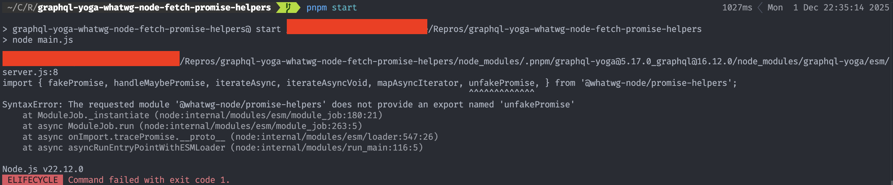

# Repro

`graphql-yoga` currently depends on `@whatwg-node/promise-helpers` version `1.2.4`, but relies on an `unfakePromise` export which was only added in `1.3.0`.

Unhelpfully, the `1.3.0` [changelog](https://github.com/ardatan/whatwg-node/blob/master/packages/promise-helpers/CHANGELOG.md) does not mention the new export, but it can be seen by comparing the [`1.2.4` npm code](https://www.npmjs.com/package/@whatwg-node/promise-helpers/v/1.2.4?activeTab=code) and the [`1.3.0` npm code](https://www.npmjs.com/package/@whatwg-node/promise-helpers/v/1.3.0?activeTab=code).

This likely has been missed because installing a fresh version of `graphql-yoga` will grab the latest `1.x` version of `@whatwg-node/promise-helpers`, but when upgrading from an older version of `graphql-yoga` which doesn't use `unfakePromise` to a more recent version will reveal the bug.

See the code in this repo and sample output below for a simple reproduction.

